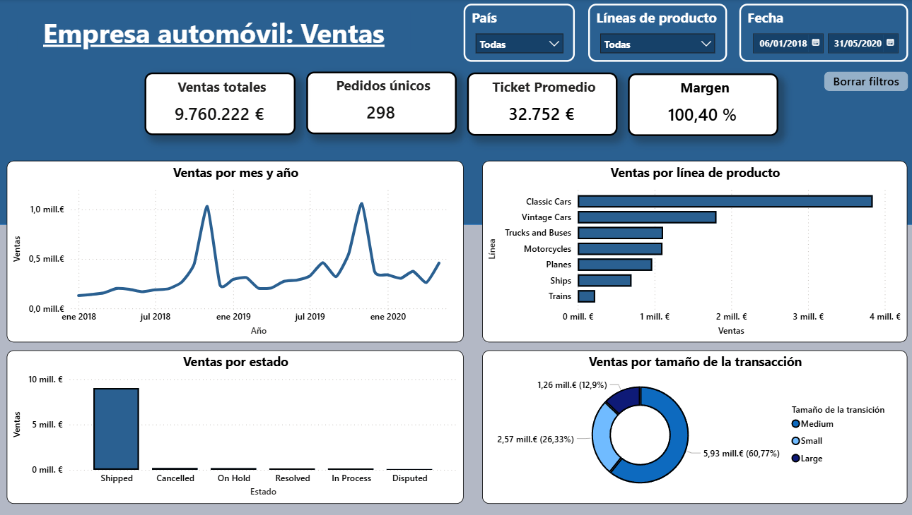

# Análisis Estratégico de Ventas y Clientes | Sector Automóvil

Este proyecto presenta un análisis integral de los datos transaccionales de una compañía del sector automotriz. El flujo de trabajo abarca desde la limpieza de datos y el Análisis Exploratorio (EDA) hasta técnicas avanzadas de segmentación de clientes (RFM) y validación estadística (ANOVA), transformando datos brutos en insights accionables para la toma de decisiones.

## 📊 Vista Previa del Dashboard

*Visualización interactiva de KPIs, tendencias temporales y distribución geográfica realizada en Power BI.*

## 📝 Resumen del Proyecto
El objetivo es optimizar la estrategia comercial mediante el entendimiento profundo del ciclo de vida del cliente y el rendimiento del portafolio. Se trabajó con un dataset de **2.747 registros** con integridad total (0% nulos, 0% duplicados), asegurando un análisis basado en datos consistentes.

**Unidad monetaria:** Euros (€).

## 🎯 Objetivos Principales
* **Patrones de Consumo:** Identificar comportamientos históricos y factores que impulsan la demanda.
* **Optimización de Portafolio:** Evaluar el rendimiento de líneas de negocio (Classic Cars, Trucks, etc.).
* **Segmentación RFM:** Clasificar la cartera de clientes para diseñar estrategias de retención efectivas.
* **Rigor Estadístico:** Aplicar ANOVA y Hedges' g para validar diferencias significativas de ventas entre productos.

## 🛠️ Stack Tecnológico
| Categoría | Herramientas |
| :--- | :--- |
| **Lenguaje** | Python 3.x |
| **Manipulación de Datos** | Pandas, Numpy, Sidetable |
| **Visualización** | Matplotlib, Seaborn, Plotly |
| **Estadística** | Scipy, Pingouin (ANOVA, Hedges' g) |
| **BI** | Power BI |

## 📁 Estructura del Repositorio
* `data/`: Datasets originales (raw) y procesados.
* `notebooks/`: Jupyter Notebook con el flujo completo de Ciencia de Datos.
* `dashboard/`: Archivo fuente del dashboard y capturas de pantalla.

---

## 📈 Conclusiones Clave (Insights)

### 💰 Desempeño Comercial y Precios
* **Posicionamiento de Marca:** El precio promedio de venta (101€) supera al MSRP sugerido (100€), demostrando una **baja dependencia de descuentos** y un sólido valor percibido.
* **Escalabilidad:** Existe una correlación positiva directa entre el volumen de unidades por pedido y los ingresos. El negocio escala linealmente con el tamaño del ticket.
* **Dominio Geográfico:** EE.UU. lidera el mercado (33% de pedidos), con **Madrid como la ciudad referente** a nivel global (304 transacciones).

### 🚗 Análisis de Producto (Validación ANOVA)
* **Liderazgo Estadístico:** El test ANOVA confirma que **Classic Cars** y **Trucks & Buses** son los motores de ingresos, superando significativamente (p < 0.05) al resto de categorías por más de 1.000€ en media.
* **Impacto Real:** El estadístico *Hedges' g* (~0.50) confirma que estas diferencias tienen una relevancia práctica importante para la asignación de recursos y no son fruto del azar.

### 👥 Salud del Cliente (RFM y Adquisición)
* **Alerta de Captación:** Se detectó un cese en la adquisición de nuevos clientes desde septiembre de 2019. El crecimiento actual depende 100% de la base instalada.
* **Valor de Cartera:** El **42% de los clientes** se sitúan en los niveles "Alto" y "Muy Alto" del análisis RFM, siendo los pilares de la estabilidad financiera de la empresa.

---

## 🚀 Acciones Recomendadas

1.  **Reactivación de Captación:** Investigar la causa del estancamiento en la adquisición desde 2019 y lanzar campañas en mercados clave (EE.UU. y España).
2.  **Programa de Fidelización VIP:** Blindar al 42% de clientes de alto valor detectados en el RFM para asegurar el flujo de caja recurrente.
3.  **Incentivos de Volumen:** Fomentar pedidos de mayor tamaño mediante descuentos por escala, dado que el volumen por pedido es la palanca de ingresos más sensible.
4.  **Optimización de Inventario:** Priorizar la inversión en *Classic Cars* y reevaluar la viabilidad de líneas de bajo rendimiento como *Ships* o *Trains*.

---

## 📧 Contacto
Analista de Datos | Ángel Cuenca Gómez
www.linkedin.com/in/ángel-cuenca-gómez | angelcuencagomez@gmail.com
